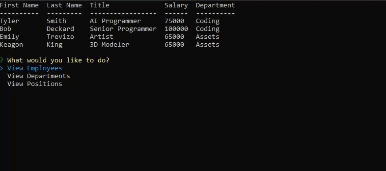

---

# Team Payroll Manager

##### *Manage your employees using this useful CLI (Command Line Interface) application.*

#### Last Updated: **10/15/20** 

## Features

- Utilizes Department > Position > Employee heirarchy
- Add, remove, and update your database easily using your CLI
- Persistent storage
- View Budget for an entire department

## Creation (caution: nerdy):

- This was created (like all of my projects) with modularity in mind.
This means that all of the prompts and code here can be expanded to fit whatever needs are required. 

- The database javascript was made using a constructing and uses prototypes for more performant code. (/Assets/Scripts/connection.js)

- Utilizes MySQL for Node. The queries were promisified for readability, and to avoid a series of callbacks.